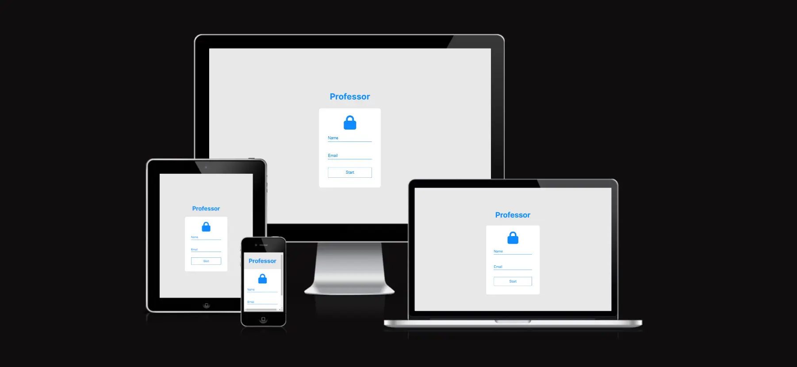

# Professor - General Culture Quiz

**Welcome to Professor - Question Bank!**

Join an exciting trivia journey and experience the interactive quiz on Professor. Professor offers an interactive quiz platform where learning meets fun. Whether you're a knowledge enthusiast or looking to test your general knowledge, Professor is tailored just for you.

🔒 **Secure Entry:**
Start your adventure by entering your name and email into the secure entry form. Your information is securely stored for a personalized experience.

🏆 **Earn Points:**
Answer questions correctly to earn points and track your progress. Compete against yourself or challenge your friends to see who can achieve the highest score.

🌐 **Share Your Success:**
Showcase your scores on social media to share your achievements. Invite your friends to surpass your score and join the Professor community.

🚀 Experience the Randomized Challenge:
Professor ensures a fresh and exciting experience every time you play. The app's intelligent randomization feature selects questions dynamically, keeping the game dynamic and enjoyable.

You can acess live application here: [Professor](https://mdurmus.github.io/professor)

**How to Play:**
- Log in with your name and email.
- Explore various question categories.
- Answer each question within the allotted time.
- Earn points and climb the leaderboard.

Get ready to explore the world of knowledge in a fun and interactive way. Start your trivia journey with Professor - Question Bank now!

Favicons generated from https://realfavicongenerator.net/

css variable function from w3school : https://www.w3schools.com/css/css3_variables.asp

session storage document : https://developer.mozilla.org/en-US/docs/Web/API/Window/sessionStorage

Questions created by ChatGPT.

Kullanici bilgisini json'a cevirip alamadim. bundan dolayi bilgileri session'a nesne olarak degil key value olarak ekledim.
kaynak: https://developer.mozilla.org/en-US/docs/Web/API/Window/sessionStorage