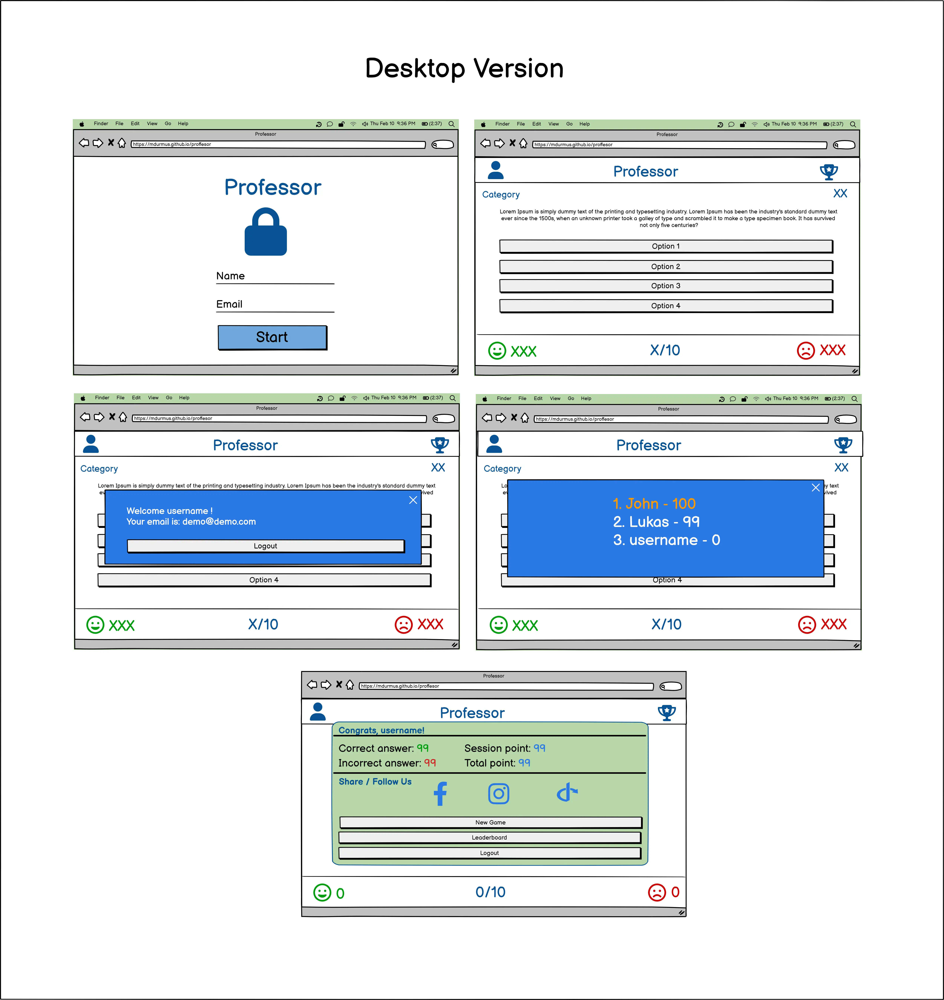
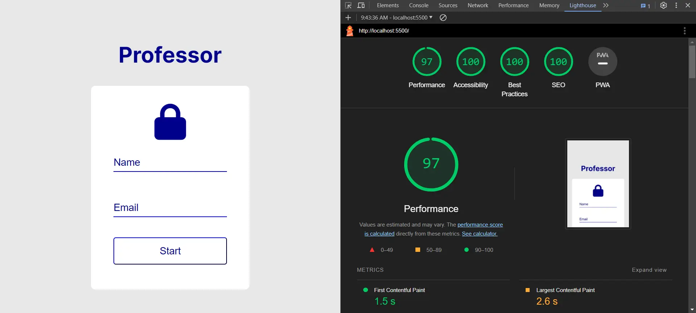
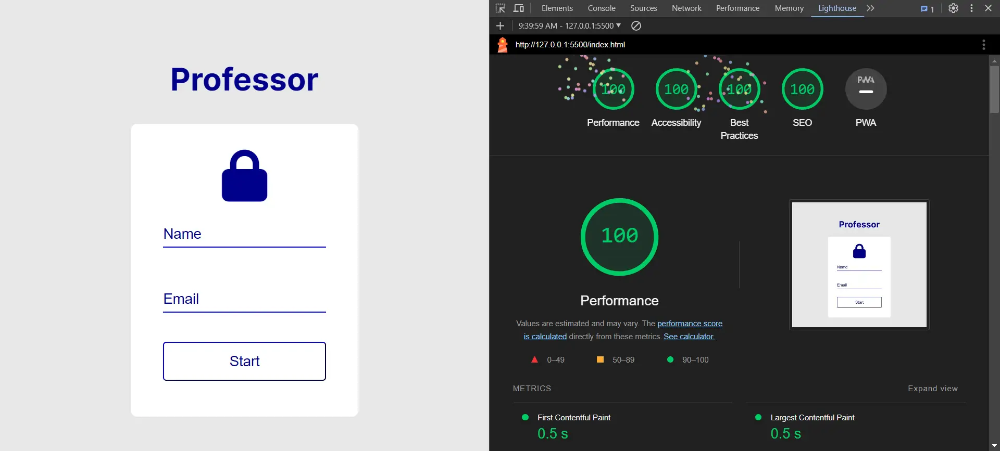

# Professor - General Culture Quiz

**Welcome to Professor - Question Bank!**

Join an exciting trivia journey and experience the interactive quiz on Professor. Professor offers an interactive quiz platform where learning meets fun. Whether you're a knowledge enthusiast or looking to test your general knowledge, Professor is tailored just for you.

🔒 **Secure Entry:**
Start your adventure by entering your name and email into the secure entry form. Your information is securely stored for a personalized experience.

🏆 **Earn Points:**
Answer questions correctly to earn points and track your progress. Compete against yourself or challenge your friends to see who can achieve the highest score.

🌐 **Share Your Success:**
Showcase your scores on social media to share your achievements. Invite your friends to surpass your score and join the Professor community.

🚀 Experience the Randomized Challenge:
Professor ensures a fresh and exciting experience every time you play. The app's intelligent randomization feature selects questions dynamically, keeping the game dynamic and enjoyable.

You can acess live application here: [Professor](https://mdurmus.github.io/professor)

## Site Owner Goals:

- **Increase User Engagement:**
  - Encourage regular participation in quizzes.
  - Ensure users spend more time within the application.

- **Foster Community Interaction:**
  - Build a sense of community among users.
  - Strengthen the user base through increased interaction.

- **Expand User Base:**
  - Broaden visibility to reach a wider audience.
  - Implement marketing and promotional activities.
  - Establish a presence on various platforms.

- **Merge Education and Entertainment:**
  - Create an environment where users can learn while having fun.

## User Stories

### First-time users

- Professor ensures your safety with a secure login feature. With the assurance that your personal information is protected, you can focus on exploring the app.

- Explore carefully selected questions in different categories to enhance your general knowledge. Engage with questions from history, science, art, and more.

- Learn correct answers with each question and receive valuable hints for incorrect answers, allowing you to track your progress.

- Only 30 seconds per question! Race against time, push your limits, and enhance your quick-thinking skills.

- Share your earned points with pride! Professor provides an opportunity to compete with friends on social platforms and share your achievements.

### Returning user:

- Experience the excitement of learning new information every time with the updated question bank. 

- To be honoured as I increase my knowledge and to invite my friends by sharing it on social media

## Design

### Colors

The color palette of the application primarily revolves around shades of blue and white. Various tones of blue are employed to create a cohesive visual experience. The use of a dark grey font ensures excellent legibility, offering a strong contrast against the light blue and white backgrounds. This thoughtful color combination enhances the overall readability and aesthetics of the interface.

### Fonts
Inter is a modern, clean, and readable sans-serif font family. It offers a broad range of characters and style variations, providing versatility in usage. Designed specifically for web applications and other digital platforms, Inter is commonly preferred in such projects. Offering good readability and aesthetics, Inter can assist in achieving a professional and contemporary appearance.

## Wireframes

I used the [balsamiq](https://www.balsamiq.com) tool for my sketches.

Mobile Version

Tablet Version

Desktop Version

## Features

The application is a complete single page application. It allows you to use every function on a single screen. It has been tested on all screen resolutions. You can find the list of devices below.

## Login Screen

Users are required to provide a name. They must also provide an email address. 

## Users's Panel

With a simple design and functional use, Professor provides its users with an enjoyable learning experience.

### User's Info

Users can view their login information on this screen or log out if they wish. 

### Leaderboard

On this screen, users can view users who have reached peaks of knowledge, or they can reach that peak themselves.

## Question Section

On this screen the user can see which category the problem is in. They can also see how many seconds they have left with a timer. If there are less than 20 seconds left, the timer is shown in orange and if there are less than 10 seconds left, it is shown in red.

Also, when the user gives an answer (i.e. clicks on one of the option buttons), the background color is green if the answer is correct and red if the answer is incorrect. And if the answer is incorrect, a hint for this answer is also given in the question field.

## Scoreboard

On this screen, users can see their correct answer on the left side of the screen in green and their incorrect answer on the right side of the screen in red. They can also see the number of questions they have solved in a total of 10 questions in the middle of the screen in blue.

## Result Section

On this screen, users can view their total points earned during an exam, as well as how many correct answers and how many incorrect answers they gave during that session. If they wish, they can share their achievements on social media platforms.

They can start a new game, view the leaderboard or log out of the system with the buttons at the bottom.

**How to Play:**
- Log in with your name and email.
- Answer each question within the allotted time.
- Earn points and climb the leaderboard.

### Features Left to Implement
Features such as the ability to add questions, send points to your e-mail address or invite other friends could have been added.

## Testing

### Validator Testing

HTML Validation

 [Html Validator](https://validator.w3.org/nu/?doc=https%3A%2F%2Fmdurmus.github.io%2Fprofessor%2F)

 No errors were returned when passing through the official W3C Markup Validator.

CSS Validation

[CSS Validator](https://jigsaw.w3.org/css-validator/validator?uri=https%3A%2F%2Fmdurmus.github.io%2Fprofessor%2F&profile=css3svg&usermedium=all&warning=1&vextwarning=&lang=en)

Javascript Validation

No errors were returned when passing through the Jshint.com

Lighthouse Mobile Testing

Lighthouse Desktop Testing

### Browser Testing

- The Website was tested on Google Chrome, Firefox, Microsoft Edge, Safari browsers with no issues noted.

### Device Testing

- The website was viewed on a variety of devices such as Desktop, Laptop, iPhone 8, iPhoneX, iPhone 14, iPhone 6,7,8, Samsung Galaxy S20, Galaxy Fold and iPad, iPad Pro to ensure responsiveness on various screen sizes. The website performed as intended. The responsive design was also checked using Chrome developer tools across multiple devices with structural integrity holding for the various sizes.

- I also used the following websites to test responsiveness:

     [Responsinator](http://www.responsinator.com/?url=mdurmus.github.io%2Fprofessor)

     [Am I responsive](https://ui.dev/amiresponsive?url=https://mdurmus.github.io/professor)

### Fixed Bug

**Timer not stopping**

The questions must stop with 0 in the countdown with the timer. However, if you do not use the clearInterval method, the timer object will not stop. As mentioned in https://developer.mozilla.org/en-US/docs/Web/API/clearInterval, you need to clear the timer using the clearInterval method.

**Store User Information**
HTML and CSS cannot store data within pages due to their structure. However, I was able to store user information using Javascript's Sessionstorage feature. You can access the related document here. https://developer.mozilla.org/en-US/docs/Web/API/Window/sessionStorage

**CSS and variable**
With CSS, instead of writing our color choices every time, we can set them once in the variables and then use this value over and over again wherever we want. You can access the related document from the link: https://developer.mozilla.org/en-US/docs/Web/CSS/Using_CSS_custom_properties

Favicons generated from https://realfavicongenerator.net/

css variable function from w3school : https://www.w3schools.com/css/css3_variables.asp

session storage document : https://developer.mozilla.org/en-US/docs/Web/API/Window/sessionStorage

Questions created by ChatGPT.

Kullanici bilgisini json'a cevirip alamadim. bundan dolayi bilgileri session'a nesne olarak degil key value olarak ekledim.
kaynak: https://developer.mozilla.org/en-US/docs/Web/API/Window/sessionStorage